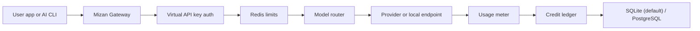

# Mizan

[](https://github.com/pendig/mizan/actions/workflows/ci.yml)
[](LICENSE)

Open-source, Rust-based AI gateway for controlled access, usage metering, and internal credit accounting.

Mizan provides a single OpenAI-compatible control surface for internal and team use.
Admins manage upstream providers and model routes, while users authenticate with
virtual API keys and consume credits with predictable limits.

## Purpose and positioning

Mizan is not trying to be a generic product SaaS boilerplate.
It is an **AI gateway + metering + policy layer**.

- The admin side defines who can access what model and how much it costs.
- The user side gets simple API-key access with usage visibility.
- The platform stays in one place for billing, limits, and audit logs.

As of **2026-06-17**, this project is in a backend/API-first production-ready
alpha boundary.

## Release boundary (v0.1.0)

Implemented and stable for core API behavior:

- SQLite-first storage with PostgreSQL-compatible migration path
- Admin seed login, user auth, API-key auth
- Provider connections and model routes
- OpenAI-compatible `/v1/models`
- OpenAI-compatible `/v1/chat/completions`
- OpenAI-compatible non-streaming `/v1/responses`
- Streaming + non-streaming chat response handling
- Usage metering and immutable credit ledger
- Redis-based RPM/TPM/concurrency controls
- Request/admin audit log foundations
- Prometheus gateway metrics
- RTK baseline CLI proxy/filtering module

Not yet in this release:

- Production hardening beyond local smoke checks
- Non-API runtime adapters (subscription CLI, browser session)
- Full dashboard UX for admin/user
- Enterprise RBAC and polished billing-marketplace features

See [docs/RELEASE_0_1_0.md](docs/RELEASE_0_1_0.md) for proof and validation.

## What works now (API-first)

### Admin capabilities
- Add provider connections and public model routes
- Configure route-level token prices per 1M input/output tokens
- Enable and disable keys/providers
- Grant and adjust user credit balances
- Read usage and ledger state

### User capabilities
- Register and login
- Create and revoke virtual keys
- List available models
- Use `/v1/chat/completions` and `/v1/responses`
- Read remaining credits and usage history

### Contract guarantees
- Normalized OpenAI-compatible API surface
- Shared normalization path for `/v1/chat/completions` and `/v1/responses`
- Stable error structure with request metadata

## Why this model (quick view)

Mizan is suitable for teams that want: control, auditability, and predictable
spend without exposing provider credentials.

It is less suitable if your first need is: full SaaS billing, built-in subscriptions,
or an enterprise-grade marketplace.

## Roadmap after API alpha

1. Ship minimal admin dashboard
2. Ship minimal user dashboard
3. Add richer provider adapters and non-API auth families
4. Add production deployment hardening and observability improvements

## UI release target

### Planned pages

- `ui/login` (Login)
- `ui/register` (Register)
- `ui/user` (User dashboard)
- `ui/user/keys` (API key management)
- `ui/user/usage` (Usage history)
- `ui/admin` (Admin overview)
- `ui/admin/providers` (Provider connections)
- `ui/admin/routes` (Model routes)
- `ui/admin/usage` (Usage and grants overview)

### UI screenshot placeholders

After release, include screenshots at:
- `docs/screenshots/admin-dashboard.png`
- `docs/screenshots/user-dashboard.png`
- `docs/screenshots/usage-overview.png`
- `docs/screenshots/provider-routes.png`

## Architecture



## Open-source repository readiness

Mizan follows common OSS project patterns:

- Apache-2.0 license with [LICENSE](LICENSE)
- Code of conduct at [CODE_OF_CONDUCT.md](CODE_OF_CONDUCT.md)
- Security policy at [SECURITY.md](SECURITY.md)
- Contribution guide at [CONTRIBUTING.md](CONTRIBUTING.md)
- Branch-level CI in [.github/workflows/ci.yml](.github/workflows/ci.yml)
- Issue templates in [.github/ISSUE_TEMPLATE](.github/ISSUE_TEMPLATE)
- PR template in [.github/PULL_REQUEST_TEMPLATE.md](.github/PULL_REQUEST_TEMPLATE.md)
- Dependabot in [.github/dependabot.yml](.github/dependabot.yml)
- Release notes in [CHANGELOG.md](CHANGELOG.md)

Recommended repository settings for public OSS quality (manual in GitHub):
- Require status checks before merging
- Protect `main` from force pushes
- Enforce PR template and issue templates
- Enable Dependabot security alerts
- Add at least one maintainer approval rule
- Enable Discussions or a clear support channel

Full checklist is in [docs/GITHUB_READINESS.md](docs/GITHUB_READINESS.md).

## Quick start

```sh
docker compose up --build
```

```sh
cargo run -p mizan-api
```

Run smoke checks with Redis available:

```sh
MIZAN_REDIS_URL=redis://127.0.0.1:6379 scripts/limit-smoke.sh
REDIS_URL=redis://127.0.0.1:6379/ scripts/alpha-smoke.sh
```

## Documentation

- [Product Requirements](docs/PRD.md)
- [Architecture](docs/ARCHITECTURE.md)
- [MVP Roadmap](docs/MVP_ROADMAP.md)
- [Backend Implementation Plan](docs/BACKEND_IMPLEMENTATION_PLAN.md)
- [Self-Hosted Distributed Proxy](docs/DISTRIBUTED_PROXY.md)
- [Alpha Runbook](docs/ALPHA_RUNBOOK.md)
- [Runtime Limit Testing](docs/LIMIT_TESTING.md)
- [Release Readiness: v0.1.0](docs/RELEASE_0_1_0.md)
- [Release Readiness: v0.1.0-alpha.1](docs/ALPHA_1_READINESS.md)
- [Project Comparison](docs/PROJECT_COMPARISON.md)
- [Engineering Principles](docs/ENGINEERING_PRINCIPLES.md)
- [Research Notes](docs/RESEARCH.md)

## Contributing

Mizan is in bootstrap and welcomes focused contributions.
Follow [CONTRIBUTING.md](CONTRIBUTING.md), then open an issue for non-trivial changes.

## Project comparison

See [docs/PROJECT_COMPARISON.md](docs/PROJECT_COMPARISON.md) for a current
comparison against [jonradoff/lastsaas](https://github.com/jonradoff/lastsaas),
[BerriAI/litellm](https://github.com/BerriAI/litellm),
[maximhq/bifrost](https://github.com/maximhq/bifrost),
[api7/aisix](https://github.com/api7/aisix), and
[LiteLLM-Labs/litellm-rust](https://github.com/LiteLLM-Labs/litellm-rust).

## License

Apache-2.0. See [LICENSE](LICENSE).

## Security

Do not commit provider credentials, user secrets, or local agent context.
See [SECURITY.md](SECURITY.md).
