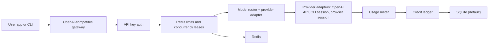
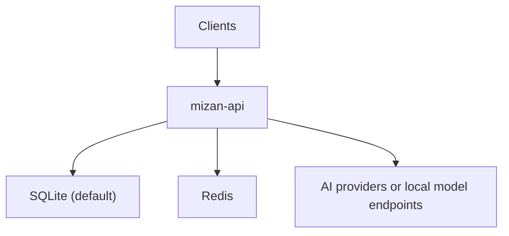

# Architecture

## Recommendation

Build the MVP in Rust with Redis and SQLite-first storage.

The v0.2.0 distributed proxy extension is described in
[Self-Hosted Distributed Proxy](DISTRIBUTED_PROXY.md). That document defines
the control-plane/data-plane split, daemon vocabulary, dispatch terms, and
trust boundaries used by the distributed milestone.

The practical recommendation is:

- Rust for the gateway, backend APIs, and RTK-based CLI proxy layer.
- Redis for hot-path runtime controls.
- SQLite for local-first storage, with PostgreSQL-ready migration compatibility.
- RTK as the starting implementation base for command-output filtering,
  token-saving CLI proxy behavior, and developer-tool integration.

The architecture should stay modular from day one. The first version does not
need every future provider or model family, but it should already have clean
boundaries so the system can grow without turning into a single large handler
crate.

Why Rust first:

- Single fast binary with low runtime overhead.
- Strong fit with RTK's existing Rust direction.
- Good async HTTP streaming with `tokio`, `axum`, and `hyper`.
- Good operational story for a high-throughput gateway.
- Shared language for the gateway and RTK-style compression layer.

RTK should not be treated as a complete gateway by itself. It should be reused
for the CLI proxy path so Mizan does not rebuild command rewriting,
command-output filtering, and token-saving analytics from zero. Mizan still
needs new modules for HTTP routing, authentication, provider adapters, wallets,
ledgering, and admin/user APIs.

## Modularity Rules

- Keep HTTP transport thin and stateless where possible.
- Keep provider-specific code behind adapter interfaces.
- Keep routing, metering, wallet, and limits as separate concerns.
- Keep tracing, logging, and request context consistent across crates.
- Keep request and response normalization in shared types, not ad hoc structs
  inside route handlers.
- Keep model registry data separate from provider transport details.
- Keep all provider outputs normalized into one OpenAI-compatible public contract at
  the edge (chat completions and responses).

These rules matter because the project will likely support many providers and
many model aliases. A clean boundary on day one is cheaper than a refactor after
the gateway is already live.

Why not Redis as the main database:

- Redis is excellent for counters, leases, rate limits, and short-lived state.
- Usage and credit history need durable, auditable records.
- Credit accounting needs transaction safety and replayability.

## High-Level Flow



## Runtime Components

### Gateway Server

Responsible for:

- OpenAI-compatible request/response surface for `/v1/chat/completions` and
  `/v1/responses`.
- Streaming proxy.
- Request id generation.
- API key authentication.
- Limit checks.
- Routing to upstream providers.
- Usage capture.
- Error normalization.

The gateway server should coordinate the request lifecycle but should not own
provider-specific transforms, credit math, or Redis limit code.

### Admin API

Responsible for:

- Provider connection CRUD.
- Model route CRUD.
- Pricing configuration.
- User/key management.
- Usage reporting.
- Manual credit grants and adjustments.

The admin API should call shared services rather than reimplementing business
rules in each route.

### User API

Responsible for:

- Registration/login.
- API key lifecycle.
- Credit balance.
- Usage history.
- Model preferences.

The user API should read from the same shared domain and ledger services as the
admin API so the behavior stays consistent.

### Router

MVP router behavior:

1. Resolve public model name.
2. Check user/key is allowed to use it.
3. Check route and provider are enabled.
4. Acquire Redis limit/concurrency leases.
5. Send request to upstream.
6. Normalize response into the canonical OpenAI-compatible shape.
7. Stream or return non-stream response to client.
8. Record usage and charge credits.

The router should only orchestrate these steps. Provider details, metering
logic, and wallet updates should live in their own modules.

Gateway completion logging is centralized behind a small recorder boundary
rather than repeated per endpoint. The recorder owns request-log field
construction, latency calculation, alias fallbacks, and async persistence. This
keeps handler branches focused on routing, billing, limits, and response
construction while preserving the existing request log schema. A full Tower
middleware can replace this boundary later, but the current shape keeps access
to route/provider context that is only known after model resolution.

Later router behavior:

- Fallback routes.
- Weighted routes.
- Cheapest route.
- Health-aware route selection.
- Per-user model preferences.
- Model alias groups such as `smart`, `cheap`, `coding`, `local`.

### Provider Adapter Interface

The first adapter can target OpenAI-compatible APIs.

```rust
#[async_trait::async_trait]
pub trait ProviderAdapter: Send + Sync {
    fn name(&self) -> &'static str;
    async fn chat_completions(&self, req: ChatRequest) -> Result<ChatResponse>;
    async fn stream_chat_completions(&self, req: ChatRequest) -> Result<ChatStream>;
    async fn responses(&self, req: ResponsesRequest) -> Result<ResponsesResponse>;
    async fn models(&self) -> Result<Vec<ProviderModel>>;
}
```

Canonical contract rule:

- Even when upstream transport uses different auth methods (`api_key`, CLI login,
  browser token/session), provider adapters are responsible for mapping to the
  same `chat` and `responses` contracts used by clients.

Adapter categories:

- `api_key`: OpenAI-compatible HTTP APIs and local models with stable response
  shape.
- `subscription_cli`: session or CLI-based connectors (Codex, Gemini CLI, Claude-like
  flows) that are normalized by adapter before serialization.
- `browser_session`: controlled browser session connectors with policy and legal
  constraints handled in provider registration and runtime guardrails.

Provider connection records should include encrypted secret material. The API
never returns raw secrets after creation.

Provider connection auth metadata is explicit:

- `auth_mode = api_key` is the current runnable mode and requires `base_url`
  plus encrypted provider API key material.
- `auth_mode = subscription_cli` and `auth_mode = browser_session` can be
  registered with non-secret `auth_config_json` reference metadata so the admin
  API and storage model do not need another shape change later.
- Non-API runtime adapters must reject raw tokens/passwords in registration
  payloads and load secret material from an external secret reference when that
  phase is implemented.

### Usage Meter

The usage meter receives a normalized completed request record and creates:

- `usage_events` row.
- `credit_ledger` row.
- Optional Prometheus/OpenTelemetry metrics.

For streaming, record usage after the final upstream chunk. If the upstream does
not return usage, estimate tokens and mark the event as estimated.

### Credit Engine

Use integer units, not floats.

Recommended units:

- Store `microcredits` as signed 64-bit integers.
- Store model prices as `microcredits_per_1m_input_tokens` and
  `microcredits_per_1m_output_tokens`.
- Charge formula:

```text
input_charge = ceil(prompt_tokens * input_price_per_1m / 1_000_000)
output_charge = ceil(completion_tokens * output_price_per_1m / 1_000_000)
total_charge = input_charge + output_charge
```

Balance safety:

- In PostgreSQL transaction, lock the user's wallet row.
- Reject if balance would go below zero.
- Insert immutable ledger row.
- Update cached wallet balance.

### Limit Engine

Use Redis for:

- API key RPM counters.
- API key TPM counters.
- User concurrency leases.
- Provider concurrency leases.
- Idempotency/dedup keys later.

Use short TTLs and Lua scripts where atomicity matters.

### Storage Model

Core tables:

- `users`
- `sessions`
- `api_keys`
- `provider_connections`
- `model_routes`
- `model_route_limits`
- `wallets`
- `credit_ledger`
- `usage_events`
- `request_logs`
- `admin_audit_logs`

Runtime Redis keys:

- `limit:rpm:key:{api_key_id}:{window}`
- `limit:tpm:key:{api_key_id}:{window}`
- `concurrency:key:{api_key_id}`
- `concurrency:user:{user_id}`
- `concurrency:provider:{provider_id}`
- `health:provider:{provider_id}`

## Minimal Deployment



Local MVP:

- `mizan-api`
- `sqlite` (data directory in compose volume)
- `redis`
- Optional `ollama` or local OpenAI-compatible server

## Repository Shape

```text
crates/mizan-api/
crates/mizan-core/
crates/mizan-gateway/
crates/mizan-providers/
crates/mizan-metering/
crates/mizan-limits/
crates/mizan-wallet/
crates/mizan-rtk/
crates/mizan-cli/
migrations/
docs/
```

If observability starts to spread across too many files, extract a small shared
instrumentation helper before the codebase becomes repetitive.

## Observability

MVP metrics:

- Request count by route, provider, model, status.
- Prompt/completion/total token count by provider/model.
- Credit spend by user/key/model.
- Latency histogram by provider/model.
- Upstream error count.
- Rate-limit blocked count.
- Insufficient-credit blocked count.

Logs should include request id but should not store raw prompts by default.
Prompt/response logging can be an explicit admin setting later.

## Security Requirements

- Hash user passwords.
- Hash virtual API keys.
- Encrypt provider secrets at rest.
- Never return provider credentials through APIs.
- Admin audit log for provider, pricing, and credit changes.
- Disable request body logging by default.
- Add per-user data deletion/export later.
