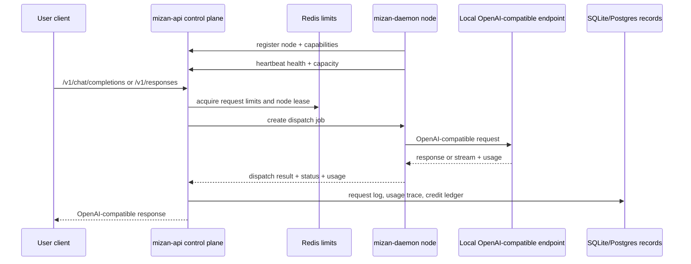

# Self-Hosted Distributed Proxy

Mizan v0.2.0 turns the existing API gateway into a distributed proxy control
plane for self-hosted OpenAI-compatible capacity. The public client contract
stays the same: users call Mizan with virtual API keys through
`/v1/chat/completions`, `/v1/responses`, and `/v1/models`.

The new runtime boundary is between the Mizan control plane and one or more
operator-run daemons. The control plane owns identity, routing, limits,
dispatch, usage records, and credit charging. Each daemon runs near a
self-hosted or private OpenAI-compatible endpoint and advertises the models and
capacity it can serve.

## Vocabulary

- **Control plane**: the existing `mizan-api` service. It authenticates users,
  manages API keys and routes, tracks daemon state, dispatches work, and records
  usage.
- **Daemon**: the new `mizan-daemon` binary operated by a host. It loads local
  provider configuration, registers with the control plane, exposes local
  health, and executes dispatch jobs against self-hosted capacity.
- **Host**: the human or organization that operates one or more daemons.
- **Node**: one daemon instance with stable identity, connection state,
  advertised capabilities, and heartbeat timestamps.
- **Capability**: a node-advertised service shape such as provider family,
  model names, context limits, streaming support, max concurrency, and local
  health status.
- **Dispatch job**: one control-plane request assignment to an eligible node,
  including model, route, user/key context, timeout budget, and trace id.
- **Usage trace**: the durable record that links requesting user, API key,
  host, node, route, model, status, latency, token usage, and charge result.

## Control Plane and Data Plane

The control plane remains `mizan-api`. It continues to own the
OpenAI-compatible API surface and the durable source of truth:

- user registration, sessions, and virtual API keys;
- provider and model route configuration;
- Redis rate limits and concurrency leases;
- node registration, heartbeats, capabilities, and dispatch state;
- usage events, request logs, and credit ledger entries.

The data plane for v0.2.0 is `mizan-daemon`. A daemon is not a public gateway.
It receives authenticated dispatch jobs from the control plane, calls the local
OpenAI-compatible provider endpoint, normalizes the provider result enough for
the control plane contract, and returns status plus usage details.

## Initial Connection Mode

The first v0.2.0 cut should use daemon-initiated outbound connections to the
control plane. This works behind NAT and avoids requiring operators to expose
daemon ports publicly.

The daemon starts with:

- control-plane URL;
- daemon token or key material path;
- local provider endpoint URL;
- advertised model list;
- max concurrency and health bind address.

For the first implementation, the daemon may poll or maintain an outbound
control connection for dispatch. The API contract should be written so a later
persistent channel can replace polling without changing node identity,
capability, usage, or dispatch terms.

## Trust Boundaries

Mizan v0.2.0 should treat the daemon as an authenticated but still limited
executor. The control plane should not trust daemon-provided billing context
that it can derive itself.

Control-plane owned fields:

- requesting user id and virtual API key id;
- route id, public model alias, and pricing rule;
- request id, trace id, timeout, and dispatch id;
- credit ledger writes and final charge status.

Daemon-owned fields:

- local provider endpoint health;
- node-level max concurrency;
- advertised model capability;
- upstream status, latency observations, and provider-returned token usage.

Shared fields:

- node id and host id;
- dispatch status and failure class;
- provider model name used for execution.

No user API key, provider API key, daemon token, or raw secret should be written
to logs or returned by API endpoints. Logs should include request ids, node ids,
route ids, model names, status, and latency instead.

## v0.2.0 Provider Scope

v0.2.0 starts with self-hosted OpenAI-compatible daemon providers only. That
means a daemon can point at a local or private endpoint that already speaks the
OpenAI-compatible chat, responses, and models shape.

Out of scope for the OSS core v0.2.0 milestone:

- Mizan Cloud marketplace, hosted billing, and payment flows;
- subscription resale or provider account sharing;
- browser-session providers;
- subscription CLI integrations;
- cross-repository cloud product orchestration.

The open-source repository should keep the control-plane vocabulary and node
records compatible with future hosted products, but those products are separate
follow-up layers.

## Dispatch and Usage Requirements

Dispatch should be idempotent around a durable dispatch id. The control plane
can retry assignment only when the prior job is unclaimed, expired, or known to
have failed before provider execution. Once a daemon has started provider
execution, retry behavior must preserve usage consistency and avoid double
charging.

Each completed request should produce one usage trace with:

- requesting user id;
- virtual API key id;
- host id and node id;
- route id and public model;
- provider model;
- dispatch id and request id;
- status and failure class;
- latency;
- prompt, completion, and total tokens when known;
- whether token usage was provider-returned or estimated.

## Follow-Up Security Items

The first release can start with daemon authentication, TLS, redacted logging,
and conservative dispatch state. Later hardening should add:

- encrypted request and response payload envelopes between control plane and
  daemon;
- stronger host trust, node attestation, or signed capability documents;
- daemon token rotation and revocation workflows;
- replay protection for dispatch jobs and heartbeat updates;
- policy controls for which users/routes can use which hosts or nodes;
- payload privacy review for streamed responses and retained request logs.
